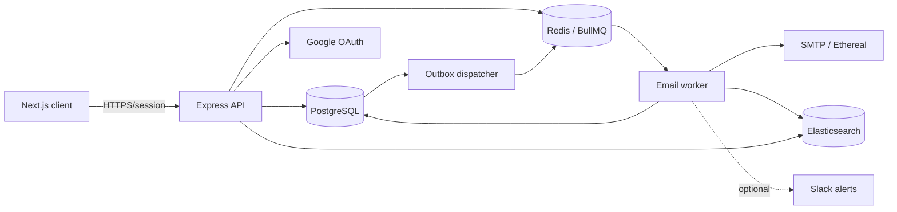
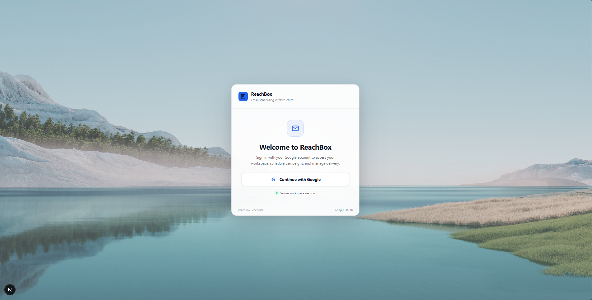
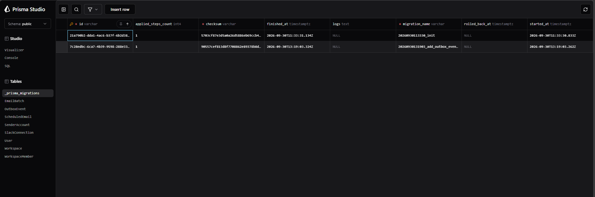
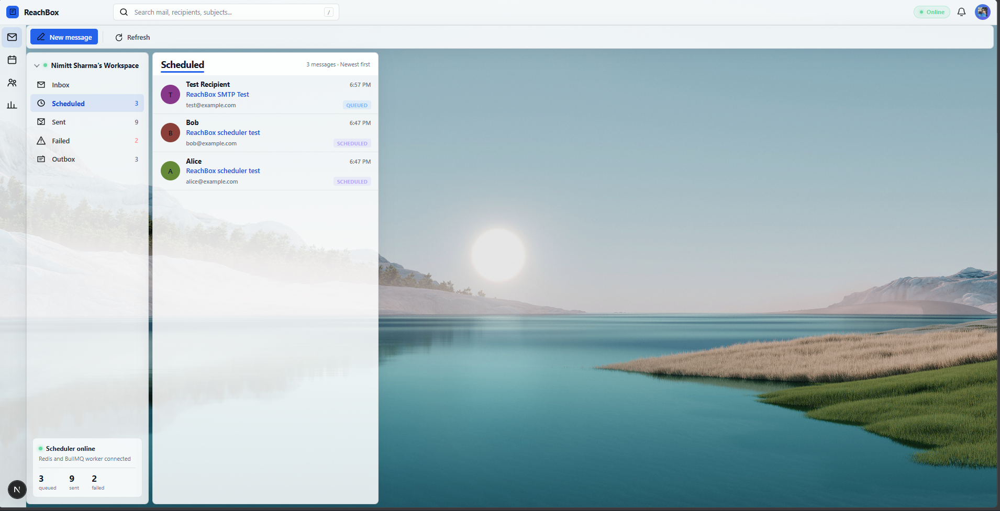
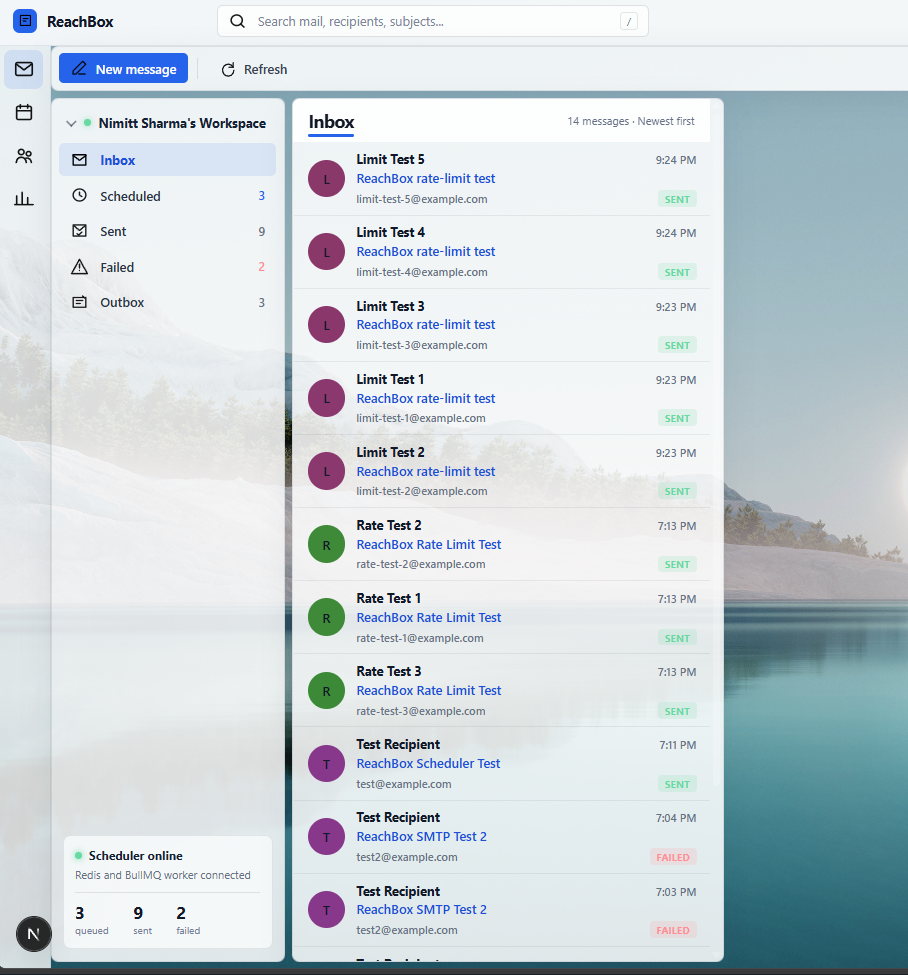
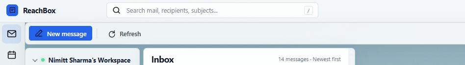
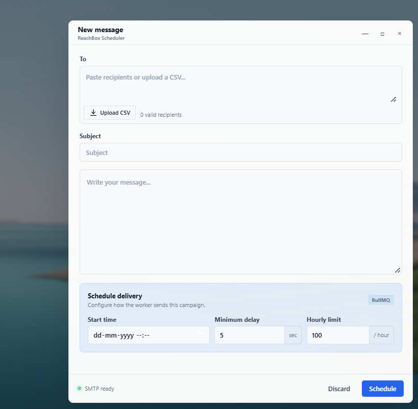
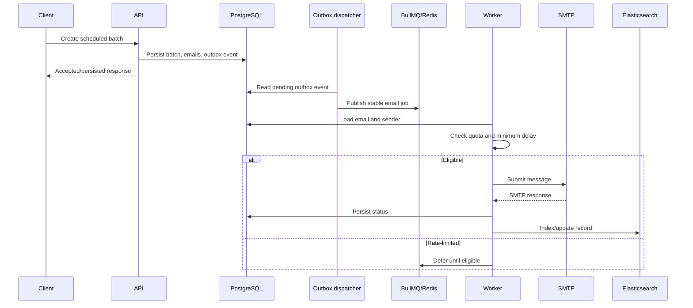

# ReachInbox Scheduler

A multi-tenant email scheduling application using TypeScript, Express,
PostgreSQL, Redis, BullMQ, Elasticsearch, and a Next.js frontend.

> **Release note:** Replace deployment placeholders with verified
> Railway domains. Slack is optional. Do not describe mock URLs or
> unverified checks as live/working.

## Contents

-   [Overview](#overview)
-   [Features](#features)
-   [Architecture](#architecture)
-   [Repository layout](#repository-layout)
-   [Screenshots](#screenshots)
-   [Prerequisites](#prerequisites)
-   [Local setup](#local-setup)
-   [Configuration](#configuration)
-   [Data and scheduling](#data-and-scheduling)
-   [Reliability](#reliability)
-   [Security](#security)
-   [Deployment](#deployment)
-   [Verification](#verification)
-   [Limitations](#limitations)
-   [Troubleshooting](#troubleshooting)

## Overview

The API accepts and persists email scheduling requests; BullMQ workers
execute delivery asynchronously. PostgreSQL is authoritative, Redis
coordinates jobs and rate controls, and Elasticsearch provides a
searchable projection. The design separates request handling from
delivery execution.

## Features

-   Google OAuth sign-in and authenticated sessions.
-   Workspace-scoped users and email records.
-   Batch composition and scheduled delivery.
-   BullMQ delayed jobs, retries, and configurable worker concurrency.
-   Sender-level hourly limits and minimum send spacing.
-   Deferred jobs when a sender is temporarily rate-limited.
-   PostgreSQL persistence and outbox-based queue publication.
-   Elasticsearch text search.
-   Queue dashboard for operational inspection.
-   Ethereal SMTP for development/test delivery.
-   Optional Slack integration; core scheduling must not require Slack
    credentials.

## Architecture



  -----------------------------------------------------------------------
  Layer                               Responsibility
  ----------------------------------- -----------------------------------
  Frontend                            Login, compose, scheduling
                                      controls, status lists, search

  API                                 Validation, authentication, tenant
                                      authorization, persistence

  PostgreSQL                          Canonical users, workspaces,
                                      batches, email states, outbox

  Redis/BullMQ                        Delayed execution, concurrency,
                                      retries, rate-limit coordination

  Worker                              Eligibility checks, SMTP
                                      submission, status updates,
                                      indexing

  Elasticsearch                       Search projection; not the source
                                      of truth

  SMTP                                External message handoff

  Slack                               Optional notifications
  -----------------------------------------------------------------------

## Repository layout

``` text
.
├── backend/          # Express API, worker, Prisma schema
├── frontend/         # Next.js application
├── images/           # README screenshots
├── src/              # Shared source, if present in this repository
├── README.md
├── .gitignore
└── docker-compose.yaml
```

Update this tree if the committed repository differs; do not move code
just to match the illustration.

## Screenshots

Place sanitized screenshots in the root `images/` directory. These
references render when the files are committed:














Suggested names: `google-login.png`, `dashboard.png`,
`compose-schedule.png`, `email-list.png`, `search.png`,
`queue-dashboard.png`, `architecture.png`. Never include credentials,
tokens, private recipient data, or database URLs in captures.

## Prerequisites

-   Node.js version compatible with package metadata (development used
    Node 22).
-   npm and Docker with Compose.
-   Google OAuth client for login.
-   SMTP test credentials (Ethereal recommended for development).
-   Optional Slack app credentials only if enabling Slack.

## Local setup

``` powershell
git clone <REPOSITORY_URL>
cd <REPOSITORY_DIRECTORY>

docker compose -f docker-compose.yaml up -d
docker compose -f docker-compose.yaml ps

cd backend
npm install
npx prisma generate
npx prisma validate
npx prisma migrate dev
npm run dev
```

Run the worker in a separate terminal using the worker script declared
in `backend/package.json` (for example `npm run worker:dev` only if that
script exists). Run the frontend separately:

``` powershell
cd frontend
npm install
npm run dev
```

Common local ports are frontend `3000`, API `4000`, PostgreSQL mapped to
`15432`, Redis `6379`, and Elasticsearch `9200`; confirm actual ports in
compose and environment files.

## Configuration

Configure local values in ignored `.env` files and production secrets in
Railway variables. Never commit secrets or paste them into logs.

  -----------------------------------------------------------------------
  Backend variable                    Purpose
  ----------------------------------- -----------------------------------
  `NODE_ENV`                          Runtime mode

  `PORT`                              API port; commonly 4000

  `DATABASE_URL`                      PostgreSQL connection string

  `REDIS_HOST`, `REDIS_PORT`          Redis endpoint

  `REDIS_PASSWORD`                    Redis password when enabled

  `WORKER_CONCURRENCY`                Worker concurrency, validated
                                      1--100; default 5

  `ELASTICSEARCH_URL`                 Elasticsearch endpoint

  `ETHEREAL_HOST`, `ETHEREAL_PORT`    SMTP endpoint

  `ETHEREAL_USER`,                    SMTP identity/configuration
  `ETHEREAL_PASSWORD`,                
  `ETHEREAL_FROM`                     

  `GOOGLE_CLIENT_ID`,                 Google OAuth credentials
  `GOOGLE_CLIENT_SECRET`              

  `GOOGLE_CALLBACK_URL`               Exact OAuth callback URL

  `AUTH_JWT_SECRET`                   Strong session signing secret (at
                                      least 32 characters)

  `FRONTEND_URL`                      Frontend origin/redirect

  `SLACK_CLIENT_ID`,                  Optional Slack integration
  `SLACK_CLIENT_SECRET`,              
  `SLACK_REDIRECT_URI`                
  -----------------------------------------------------------------------

Use the exact frontend API-base variable referenced in frontend source
(often `NEXT_PUBLIC_API_URL`; verify before configuring). Register the
deployed frontend origin and exact backend callback URL in Google OAuth
settings.

## Data and scheduling

The Prisma model includes entities such as `User`, `Workspace`,
`WorkspaceMember`, `SenderAccount`, `EmailBatch`, `ScheduledEmail`,
`SlackConnection`, and `OutboxEvent`. Check the schema for exact fields,
indexes, and constraints.



PostgreSQL is canonical. Queue state and Elasticsearch are
operational/derived representations and should be recoverable through
reconciliation/reindexing.

## Reliability

The outbox pattern reduces the gap between database persistence and
queue publication. Stable job IDs help suppress duplicate queue
insertion. Retries and backoff address transient failures.

**Do not claim exactly-once email delivery.** SMTP acceptance and
database status persistence are separate operations. A process can fail
after SMTP accepts a message but before the application records success;
a retry may duplicate delivery. Describe the system as retryable with
duplicate-risk mitigation.

Rate controls are sender-scoped as implemented; do not call them
workspace aggregate quotas unless code enforces an aggregate workspace
limit. Worker concurrency is not itself a rate limit.

## Security

-   Keep `.env*`, secrets, OAuth tokens, and private keys out of Git.
-   Rotate credentials exposed in commits, screenshots, chat, or logs.
-   Use HTTPS, restrictive CORS, secure HttpOnly cookies, and strong
    signing secrets.
-   Derive tenant identity from authenticated server-side context; do
    not trust client-supplied workspace IDs.
-   Check workspace ownership on every read/write/search operation and
    validate sender membership.
-   Protect `/admin/queues`; never expose an unauthenticated queue
    dashboard publicly.
-   Redact message content and personal data from logs.

## Deployment

Recommended Railway logical topology:

  Service         Purpose
  --------------- ----------------------------------
  Frontend        Next.js web application
  API             Express HTTP process
  Worker          Separate BullMQ consumer process
  PostgreSQL      Durable relational store
  Redis           Queue and rate coordination
  Elasticsearch   Hosted search service

Set each service's root directory, build command, and start command to
match the actual package scripts. Do not assume one monorepo command
correctly launches API and worker.

Production migration command, run from backend context after verifying
the target database:

``` powershell
npx prisma migrate deploy
```

Release checklist: - \[ \] Hosted PostgreSQL, Redis, and Elasticsearch
are reachable. - \[ \] Secrets are configured using provider
variables/references. - \[ \] Google production origin and callback are
registered. - \[ \] Frontend API URL targets the deployed API. - \[ \]
Reviewed migrations are applied. - \[ \] API and worker are separate
processes. - \[ \] Queue dashboard is access-controlled. - \[ \] Login,
schedule creation, delayed delivery, rate deferral, SMTP test, and
search are verified. - \[ \] Mock domains are replaced with real
verified deployment URLs.

URL placeholders only: `https://<frontend-domain>`,
`https://<api-domain>`, `https://<protected-api-domain>/admin/queues`.

## Verification

``` powershell
cd backend
npm run build
npx prisma validate
```

``` powershell
cd frontend
npm run build
```

Run the repository's test scripts where present. Record only tests
actually executed.

  -----------------------------------------------------------------------
  Test                                Expected check
  ----------------------------------- -----------------------------------
  OAuth                               Sign-in, session lookup, logout

  Tenant isolation                    Workspace cannot read another
                                      workspace's records

  Scheduling                          Future job waits until eligible

  Rate limit                          Excess sends defer without
                                      consuming ordinary retry attempts

  Restart                             Pending work is recoverable

  SMTP failure                        Failure state/retry policy behaves
                                      as designed

  Search                              Results are workspace-scoped and
                                      indexed

  Slack absent                        API and worker still run; email
                                      scheduling works
  -----------------------------------------------------------------------

## Limitations and next steps

-   SMTP plus database status cannot form one atomic exactly-once
    operation; a narrow duplicate window remains.
-   Slack is optional; current schema-backed integration does not
    implement refresh-token persistence. Do not rely on Slack alerts for
    correctness.
-   Elasticsearch is derived and can lag or need reindexing.
-   Confirm and document the exact rate-limit scope from code.
-   Add integration tests for restart recovery, concurrency races, and
    SMTP failure windows.
-   Add health/readiness checks, structured logs, queue-age metrics,
    alerting, and backup/recovery procedures.

## Troubleshooting

**Environment validation fails:** Verify required variables are present
without printing secret values.

**Prisma connection/migration fails:** Confirm the service uses the
intended database URL and that network access and migrations are
correct.

**Jobs remain delayed:** Inspect sender quota, minimum spacing, worker
health, Redis connectivity, and BullMQ delayed state.

**Search returns no records:** Check Elasticsearch connectivity/index
setup, indexing logs, workspace filter, and reindex/reconciliation
tooling.

**Google callback mismatch:** Compare `GOOGLE_CALLBACK_URL` exactly with
the registered provider callback, including scheme, hostname, path, and
slash.

**Slack unavailable:** Slack is optional. Verify missing Slack
credentials do not block startup; configure the integration only if it
is being enabled.

## Screenshot contribution checklist

1.  Capture using demo data.
2.  Save under root `images/`.
3.  Match filenames above or update image links.
4.  Blur addresses, OAuth identifiers, tokens, credentials, and private
    workspace content.
5.  Commit screenshots and README references together.

## License

Add the license selected for this repository. If none is selected, do
not imply that reuse rights have been granted.
